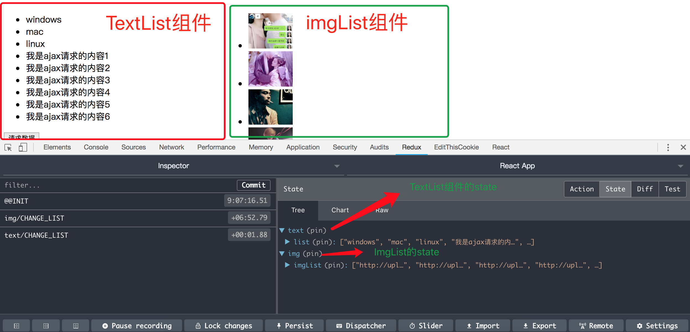

# 运行本项目
> npm install  
> npm start

# 项目简介
1，使用react-redux 方便我们管理redux  
2，使用redux-thunk 中间件处理异步的action
3，使用immutable.js 处理state,放弃之前的深拷贝  
4, 模块化reducer.js 类似vuex的module。(本项目在App组件中使用TextList和ImgList两个组件，每个组件都有自己的store，然后集成在总的store中)

# 手摸手带你撸redux：五阶(react-redux + redux-thunk + immutable)
先说一下redux的工作流程。
- 第一步,创建一个store，相当于一个数据仓库；
- 第二步,React Component根据store里面的state显示UI；
- 第三步,React Component根据需求派发action给store。(dispatch(action))；
- 第四步,store根据React Component派发的action去reducer里面找对应的操作；
- 第五步,reducer告诉store怎么操作数据；
- 第六步,store更新state；
- 第七步,循环第二步

## 1-安装react-redux , redux-thunk, immutable
> npm install react-redux immutable redux-thunk --save

## 2-创建总的store
--|src  
----|store  
------|index.js  
------|reducer.js  
  
>index.js  
```js
import { createStore, applyMiddleware, compose } from 'redux';
import thunk from 'redux-thunk';
import reducer from './reducer';

const composeEnhancers = window.__REDUX_DEVTOOLS_EXTENSION_COMPOSE__ || compose;
const store = createStore(reducer, composeEnhancers(
  applyMiddleware(thunk)
));

export default store;
```

>reducer.js
```js
import { combineReducers } from 'redux-immutable';
import { textReducer } from '../components/textlist/store';
import { imgReducer } from '../components/imglist/store';

// 使用combineReducers，组合小reducer
const reducer = combineReducers({
  text: textReducer,
  img: imgReducer
})

export default reducer;

```

## 3-创建小store（举例text组件的store ,img的store同理）
--|src  
----|components    
------|textlist    
--------|store  
----------|actionCreators.js   
----------|actionTypes.js   
----------|index.js   
----------|reducer.js   

>actionCreators.js 
```js
import * as actionTypes from './actionTypes';
import axios from 'axios';

export const changeList = (value) => ({
  type: actionTypes.CHANGE_LIST,
  value
})

export const getInitList = () => {
  return (dispatch) => {
    axios.get('/api/list.json').then((res) => {
      dispatch(changeList(res.data.data))
    }).catch((err) => {
      console.log(err);
    })
  }
}
```

>actionTypes.js  
```js
export const CHANGE_LIST = 'text/CHANGE_LIST';
export const GET_INIT_LIST = 'text/GET_INIT_LIST';
```

>index.js  
```js
import textReducer from './reducer';

import * as actionCreators from './actionCreators';
import * as actionTypes from './actionTypes';


export { textReducer, actionCreators, actionTypes };
```

>reducer.js  
```js
import * as actionTypes from './actionTypes';
import { fromJS } from 'immutable';

const defaultState = fromJS({
  list: ['windows', 'mac', 'linux']
})

// reducer 可以接收state，但是不能修改state
export default (state = defaultState, action) => {
  switch (action.type) {
    case actionTypes.CHANGE_LIST:
         
      // return state.merge({
      //   list: state.get('list').concat(fromJS(action.value))
      // });
      return state.set('list', fromJS(state.get('list').concat(action.value)));
    default:
      return state;
  }
}

```

## 4-组件中使用
> textlist的组件index.js 

```js
import React, { Component } from 'react'
import { connect } from 'react-redux';
import { actionCreators } from './store';

class TextList extends Component {

  render() {
    
    const { list, getMore } = this.props;
    return (
      <div style={{ float: 'left', width: '400px', border: '1px solid #eee' }}>
        <ul>
          {
            list.map((item, index) => {
              return (
                <li key={index}>{item}</li>
              )
            })
          }
        </ul>
        <button onClick={getMore}>请求数据</button>
      </div>

    );
  }

}

// state映射到组件的props中
const mapStateToProps = (state) => {
  return {
    list: state.getIn(['text','list'])
  }
}

// dispatch映射到组件的props中
const mapDispatchToProps = (dispatch) => {
  return {
    getMore() {
      dispatch(actionCreators.getInitList());
    }
  }
}

// 连接组件和react-redux
export default connect(mapStateToProps, mapDispatchToProps)(TextList);

```


;

